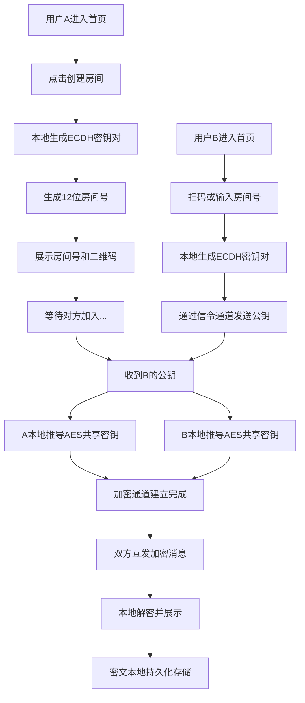

## 1. 产品概述

「密聊」是一款仿照微信风格的端对端加密即时通讯Web应用，采用ECDH密钥交换与AES-256-GCM加密技术，确保消息仅在收发双方设备上可解密，服务器仅传输无法读取的二进制密文。

- 核心价值：为隐私敏感型用户提供安全、便捷的即时通讯体验
- 目标用户：注重隐私保护的个人用户、企业机密交流场景
- 差异化：房间号机制 + 扫码加入 + 纯前端加密 + 本地存储，零服务器明文接触

## 2. 核心功能

### 2.1 用户角色

| 角色 | 注册方式 | 核心权限 |
|------|----------|----------|
| 聊天用户 | 无需注册，通过房间号加入 | 创建房间、加入房间、发送加密消息、接收解密消息 |

### 2.2 功能模块

1. **首页/房间入口页**：创建房间、加入房间、扫码加入入口
2. **房间创建页**：生成房间号、二维码展示、等待对方加入状态
3. **聊天页面**：消息列表、输入框、加密状态标识、成员列表
4. **设置面板**：加密信息展示、清空本地数据、主题切换

### 2.3 页面详情

| 页面名称 | 模块名称 | 功能描述 |
|----------|----------|----------|
| 首页 | 创建房间按钮 | 点击生成12位随机房间号，跳转房间创建页 |
| 首页 | 加入房间输入框 | 输入房间号加入已有房间 |
| 首页 | 扫码加入入口 | 调用摄像头扫描二维码加入房间 |
| 房间创建页 | 房间号展示 | 大字显示格式化房间号，支持一键复制 |
| 房间创建页 | 二维码展示 | 将房间号转换为二维码供对方扫描 |
| 房间创建页 | 等待状态 | 动态呼吸动画显示"等待对方加入..." |
| 房间创建页 | 成员上限选择 | 可选择2-10人房间上限 |
| 聊天页面 | 消息列表 | 气泡式消息展示，区分自己/对方消息 |
| 聊天页面 | 输入区域 | 文本输入、表情、图片/文件发送按钮 |
| 聊天页面 | 顶部导航 | 房间名称、加密状态徽章、返回按钮 |
| 聊天页面 | 加密标识 | 每条消息显示端对端加密锁图标 |
| 设置面板 | 加密信息 | 展示当前加密算法、密钥指纹 |
| 设置面板 | 数据管理 | 清空本地聊天记录 |

## 3. 核心流程

用户A创建房间 → 生成ECDH密钥对 → 展示房间号和二维码 → 用户B扫码/输入加入 → 双方交换公钥 → 本地推导共享会话密钥 → AES加密通讯 → 消息本地加密存储

## 4. 用户界面设计

### 4.1 设计风格

- **主色调**：微信绿 (#07C160) 作为主色，搭配深灰背景，营造安全可靠感
- **辅助色**：消息气泡绿色 (#95EC69)、对方气泡白色、背景灰 (#EDEDED)
- **按钮风格**：圆角矩形，主按钮实心绿色，次按钮边框样式
- **字体**：系统默认无衬线字体，清晰易读
- **布局风格**：卡片式布局，顶部导航栏 + 底部输入栏的经典IM布局
- **图标风格**：线性图标，简洁现代，与微信风格保持一致
- **加密视觉**：绿色锁形图标作为安全标识，密钥指纹用十六进制字符串展示

### 4.2 页面设计概览

| 页面名称 | 模块名称 | UI元素 |
|----------|----------|--------|
| 首页 | Hero区域 | 应用logo、标语"私密聊天，安全无忧" |
| 首页 | 功能卡片 | 创建房间卡片、加入房间卡片，绿色渐变边框 |
| 首页 | 底部说明 | 端对端加密安全说明文字 |
| 房间创建页 | 顶部导航 | 返回键 + "加密房间"标题 + 绿色加密徽章 |
| 房间创建页 | 房间号区 | 大号等宽字体显示房间号，复制按钮 |
| 房间创建页 | 二维码区 | 白色卡片内展示二维码，下方提示文字 |
| 房间创建页 | 等待状态 | 绿色呼吸灯 + "等待对方加入..."文字 |
| 聊天页面 | 消息气泡 | 绿色右对齐气泡（自己）、白色左对齐气泡（对方） |
| 聊天页面 | 时间戳 | 灰色小字居中显示 |
| 聊天页面 | 输入栏 | 圆角输入框 + 表情按钮 + 发送按钮 |
| 聊天页面 | 加密标识 | 消息气泡旁小锁图标 |

### 4.3 响应式设计

- 桌面端：聊天窗口居中显示，最大宽度800px，左右留白
- 平板端：自适应宽度，保持良好阅读体验
- 移动端：全屏展示，优化触摸交互，按钮尺寸≥44px
- 优先移动端体验，仿微信移动端聊天界面

### 4.4 动效设计

- 页面切换：淡入淡出 + 轻微滑动
- 消息发送：气泡弹出动画
- 等待状态：呼吸灯渐变动画
- 按钮点击：缩放反馈
- 新消息：轻微震动/高亮提示
