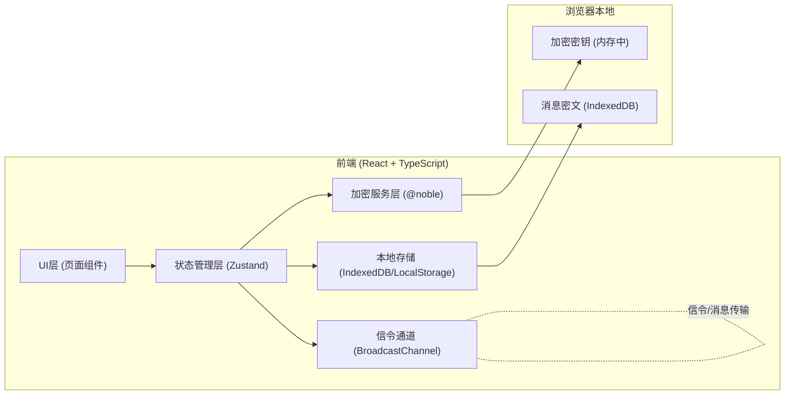
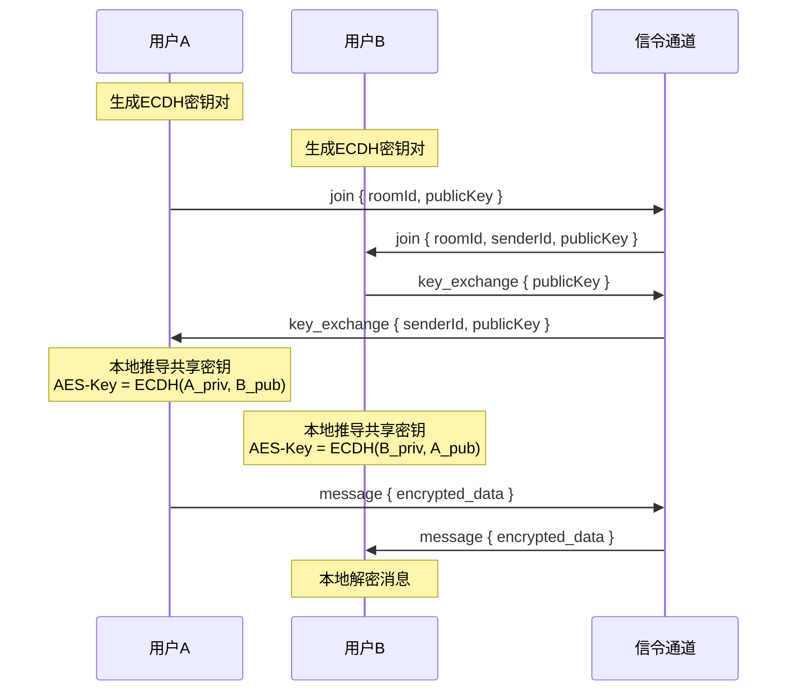

## 1. 架构设计



## 2. 技术选型说明

### 前端框架
- **React 18**：组件化开发，生态完善
- **TypeScript 5**：类型安全，提升代码可维护性
- **Vite 5**：快速构建，开发体验优秀
- **Tailwind CSS 3**：原子化CSS，快速构建UI
- **React Router 6**：客户端路由管理

### 加密库（核心）
- **@noble/curves**：纯JS实现的椭圆曲线库，用于ECDH P-256密钥交换
- **@noble/ciphers**：纯JS实现的对称加密库，用于AES-256-GCM加密
- 选择原因：不依赖Web Crypto API，纯JS实现，兼容性好，经过安全审计

### 状态管理
- **Zustand**：轻量级状态管理，简单易用，适合中小型应用

### 信令通道
- **BroadcastChannel API**：浏览器标签页间通信，用于本地演示
- （生产环境可替换为WebSocket/Supabase Realtime）

### 本地存储
- **LocalStorage**：存储房间配置、用户信息等小数据
- **IndexedDB**：存储加密后的消息历史（大容量）

### 其他工具库
- **qrcode.react**：二维码生成
- **html5-qrcode**：二维码扫描（摄像头扫码）
- **dayjs**：时间格式化

## 3. 路由定义

| 路由路径 | 页面组件 | 功能说明 |
|----------|----------|----------|
| `/` | HomePage | 首页：创建/加入房间入口 |
| `/create` | CreateRoomPage | 创建房间：展示房间号和二维码 |
| `/join` | JoinRoomPage | 加入房间：输入房间号或扫码 |
| `/chat/:roomId` | ChatPage | 聊天页面：消息收发 |
| `/settings` | SettingsPage | 设置页面：加密信息、数据管理 |

## 4. 核心数据结构

### 4.1 密钥相关类型

```typescript
// ECDH 密钥对
interface KeyPair {
  privateKey: Uint8Array;  // 32字节私钥（内存中，不持久化）
  publicKey: Uint8Array;   // 65字节未压缩公钥
}

// AES 对称密钥
interface AesKey {
  raw: Uint8Array;  // 32字节密钥
}

// 加密消息格式
interface EncryptedMessage {
  iv: string;          // Base64编码的12字节IV
  ciphertext: string;  // Base64编码的密文+认证标签
  timestamp: number;
  senderId: string;
}
```

### 4.2 消息类型

```typescript
// 明文消息
interface Message {
  id: string;
  type: 'text' | 'image' | 'file';
  content: string;  // 文本内容或文件URL
  timestamp: number;
  senderId: string;
  senderName: string;
}

// 房间信息
interface Room {
  id: string;           // 12位房间号
  name: string;
  maxMembers: number;
  createdAt: number;
  members: Member[];
}

// 成员信息
interface Member {
  id: string;
  name: string;
  publicKey: string;  // Base64编码的公钥
}
```

### 4.3 信令消息类型

```typescript
// 信令消息类型
type SignalType = 'join' | 'key_exchange' | 'message' | 'leave';

interface SignalMessage {
  type: SignalType;
  roomId: string;
  senderId: string;
  payload: any;
  timestamp: number;
}
```

## 5. 加密协议流程



## 6. 项目目录结构

```
src/
├── components/          # 公共组件
│   ├── Layout/         # 布局组件
│   ├── MessageBubble/  # 消息气泡
│   ├── QRCode/         # 二维码组件
│   └── ...
├── pages/              # 页面组件
│   ├── HomePage.tsx
│   ├── CreateRoomPage.tsx
│   ├── JoinRoomPage.tsx
│   └── ChatPage.tsx
├── store/              # 状态管理
│   └── useStore.ts
├── crypto/             # 加密模块
│   ├── ecdh.ts         # ECDH密钥交换
│   ├── aes.ts          # AES-GCM加解密
│   └── utils.ts        # 编码工具函数
├── signal/             # 信令通道
│   └── channel.ts
├── storage/            # 本地存储
│   ├── index.ts
│   └── messages.ts
├── types/              # TypeScript类型定义
│   └── index.ts
├── utils/              # 工具函数
│   ├── roomId.ts       # 房间号生成
│   └── format.ts
├── App.tsx
├── main.tsx
└── index.css
```

## 7. 加密算法详细说明

### 7.1 ECDH P-256 密钥交换
- 曲线：NIST P-256 (secp256r1)
- 私钥：32字节随机数
- 公钥：65字节未压缩格式 (0x04 + X + Y)
- 共享密钥：取共享点X坐标前32字节

### 7.2 AES-256-GCM 对称加密
- 密钥长度：256位 (32字节)
- IV长度：96位 (12字节)，每次加密随机生成
- 认证标签：128位 (16字节)，GCM模式自动生成
- 密文格式：IV + Ciphertext + Tag
- 编码：Base64编码便于传输

### 7.3 安全特性
- 前向安全：每次会话生成新密钥对
- 消息认证：GCM模式提供完整性校验
- 抗重放：时间戳 + IV随机性
